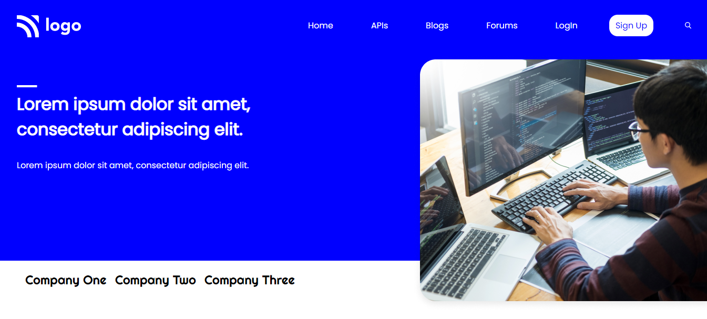

# Project 9 - HTML  and CSS 

> 
>
> By Naga Rajasekhar

You can find the live deployment link of this web page here --> **[Live Deployment Link](#)**
 
 
 
 

 

### Learnings from completing this project

1. Gained knowledge about postions and its properties 
2. Learnt about box-shadow and its properties
3. Learnt about flex and its properties
4. Gained knowledge on how to use background colors
5. Gained knowledge about padding, margin, colors, border and their values
